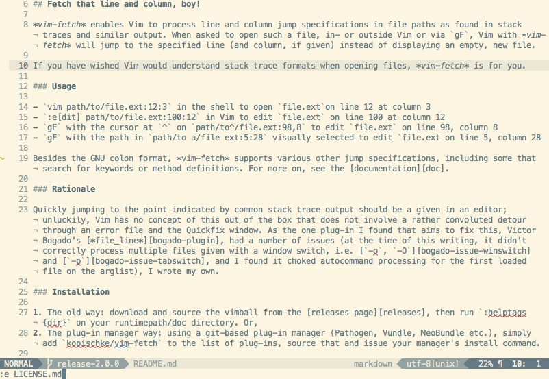

# Vim-fetch

> Fetch that line and column, boy!

<!-- vim-markdown-toc GFM -->

- [Intro](#intro)
- [Usage](#usage)
- [Rationale](#rationale)
- [Installation](#installation)
- [License](#license)

<!-- vim-markdown-toc -->

## Intro

_vim-fetch_ enables Vim to process line and column jump specifications in file
paths as found in stack traces and similar output. When asked to open such a
file, in- or outside Vim or via `gF`, Vim with _vim-fetch_ will jump to the
specified line (and column, if given) instead of displaying an empty, new file.

If you have wished Vim would have a better understanding of stack trace formats than what it offers out of the box, _vim-fetch_ is for you.

## Usage

- `vim path/to/file.ext:12:3` in the shell to open `file.ext` on line 12 at column 3
- `:e[dit] path/to/file.ext:100:12` in Vim to edit `file.ext` on line 100 at column 12
- `gF` with the cursor at `^` on `path/to^/file.ext:98,8` to edit `file.ext` on line 98, column 8
- `gF` with the selection `|...|` on `|path to/file.ext|:5:2` to edit `file.ext` on line 5, column 2

Besides the GNU colon format, _vim-fetch_ supports various other jump specification formats, including some that search for keywords or method definitions. For more, see the [documentation][doc].

## Rationale

Quickly jumping to the point indicated by common stack trace output should be a given in an editor; unluckily, Vim has no concept of this out of the box that does not involve a rather convoluted detour through an error file and the Quickfix window. As the one plug-in that aimed to fix this, Victor Bogado’s [_file_line_][bogado-plugin], had a number of issues (at the time of this writing, it didn’t correctly process multiple files given with a window switch, i.e. [`-o`, `-O`][bogado-issue-winswitch] and [`-p`][bogado-issue-tabswitch], and as it choked autocommand processing for the first loaded file on the arglist), _vim-fetch_ was born.

## Installation

1. The old way: download and source the vimball from the [releases page](https://github.com/wsdjeg/vim-fetch/releases), then run `:helptags {dir}` on your runtimepath/doc directory. Or,
2. The plug-in manager way: using a git-based plug-in manager (Pathogen, Vundle, NeoBundle etc.), simply add `wsdjeg/vim-fetch` to the list of plug-ins, source that and issue your manager's install command.

## License

_vim-fetch_ is licensed under [the terms of the MIT license according to the accompanying license file](LICENSE.md).
